# Emoji Collection

A collection of emojis for easy access in the future .

**330 emojis**

This README was generated using `./generate-readme.sh`.

## panda

| Emoji preview | Emoji name |
| --- | --- |
|  | Panda1.webp |
|  | Panda2.webp |
| 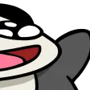 | Panda3.webp |
|  | PandaAhh.webp |
| 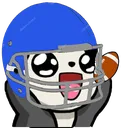 | PandaAmericanFootball.webp |
|  | PandaAngel.webp |
| 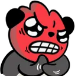 | PandaAngry.webp |
| 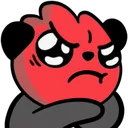 | PandaAngry2.webp |
| 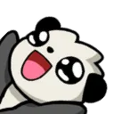 | PandaAppear.webp |
|  | PandaAwwShakeZoom.gif |
|  | PandaBaby.gif |
|  | PandaBackPack.webp |
|  | PandaBakoom(1).gif |
|  | PandaBAKOOM.gif |
| 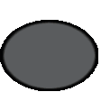 | PandaBall.gif |
|  | PandaBarley.webp |
| 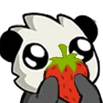 | PandaBerry.webp |
|  | PandaBibble.gif |
|  | Pandabigboi.webp |
|  | PandaBirthday.webp |
|  | PandaBlank.webp |
| 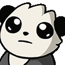 | PandaBlankBlink.gif |
|  | PandaBlankGlitch.gif |
|  | PandaBleh.webp |
|  | PandaBless.webp |
|  | pandablind.webp |
|  | PandaBlindHi.webp |
|  | PandaBlindRun.gif |
| 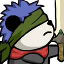 | PandaBlindSword1.webp |
| 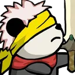 | PandaBlindSword2.webp |
|  | PandaBlob.gif |
|  | PandaBlush.webp |
|  | PandaBobble.gif |
|  | PandaBonk.webp |
|  | PandaBonkBanned.gif |
|  | PandaBoop.gif |
| 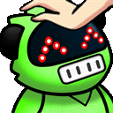 | PandaBotPat.gif |
| 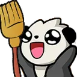 | PandaBroom.webp |
|  | PandaBroomDerp.webp |
| 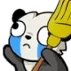 | PandaBroomSad.webp |
| 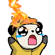 | PandaBurnt.gif |
|  | PandaBurntRun.gif |
| 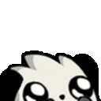 | PandaBye.gif |
|  | PandaCaneCop.webp |
| 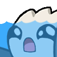 | PandaCantSwim.gif |
| 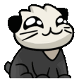 | PandaCat.gif |
| 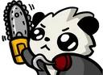 | PandaChainsaw.webp |
|  | PandaChef.webp |
| 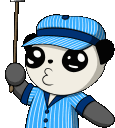 | PandaChooChoo.gif |
|  | PandaChop.gif |
| 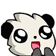 | PandaClap.gif |
|  | PandaCloak.webp |
|  | PandaCloseLeft.webp |
|  | PandaCloseRight.webp |
|  | PandaCoffee.gif |
|  | PandaConfused1.webp |
|  | PandaCookie.webp |
| 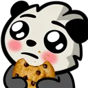 | PandaCookieBlush.webp |
| 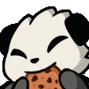 | PandaCookieEat.gif |
|  | PandaCookiePing.gif |
|  | PandaCool.webp |
|  | PandaCoolshiny.gif |
|  | PandaCoolSip.webp |
| 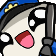 | PandaCopSwing.gif |
| 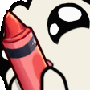 | PandaCrayonPeek.gif |
|  | PandaCrazy.webp |
|  | PandaCrewmate.webp |
|  | PandaCry.webp |
| 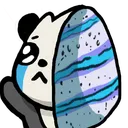 | PandaCryCake.webp |
| 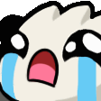 | PandaCryFill.gif |
|  | PandaCryYou.webp |
|  | PandaCult.webp |
| 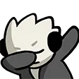 | PandaDab.webp |
|  | PandaDarkHi.webp |
| 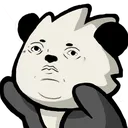 | PandaDeadInside.webp |
|  | PandaDerp.webp |
|  | PandaDerpv2.webp |
| 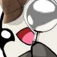 | PandaDetective.webp |
| 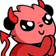 | PandaDevil.webp |
| 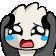 | PandaDevilScary.gif |
|  | PandaDevilv2.webp |
| 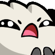 | PandaDisgustedClap.gif |
|  | PandaDoublePing.webp |
|  | PandaDracula.webp |
| 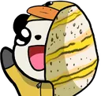 | PandaDuckCake.webp |
|  | PandaDuckChase1.gif |
|  | PandaDuckChase2.gif |
|  | PandaDuckChase3.gif |
| 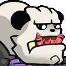 | PandaEat.gif |
| 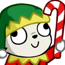 | PandaElf.webp |
|  | PandaEvil.webp |
| 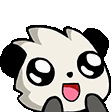 | PandaExcited.gif |
|  | PandaExperiment.webp |
|  | PandaEZ.webp |
|  | PandaF.webp |
| 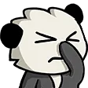 | PandaFacepalm.webp |
|  | PandaFat.webp |
| 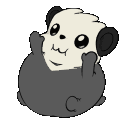 | PandaFatPat.gif |
| 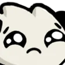 | PandaFeels.webp |
|  | PandaFightL.gif |
| 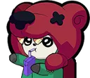 | PandaFightNite.webp |
| 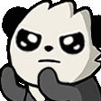 | PandaFightR.gif |
| 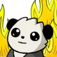 | PandaFine.webp |
|  | PandaFingersCrossed.webp |
| 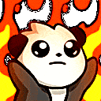 | PandaFire.gif |
|  | PandaFireTruck1.gif |
|  | PandaFireTruck2.gif |
|  | PandaFireTruck3.gif |
| 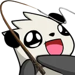 | PandaFish.webp |
|  | PandaFlex.webp |
| 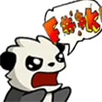 | PandaFoul.webp |
|  | PandaFrozen.webp |
|  | PandaFunni.webp |
|  | PandaGasm.webp |
| 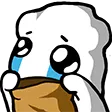 | PandaGhost.webp |
|  | PandaGift.gif |
|  | PandaGiftv2.webp |
| 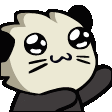 | PandaGimme.gif |
| 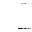 | PandaGlitchTheVoid.gif |
| 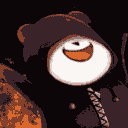 | PandaGlory.gif |
| 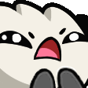 | PandaGolfClap.gif |
|  | PandaGreedySip.webp |
|  | PandaGrinRee.webp |
|  | PandaGun.webp |
|  | PandaHack.gif |
|  | PandaHappyWhale.webp |
|  | PandaHatScarf.webp |
|  | PandaHey.webp |
|  | PandaHeyaPolice.webp |
|  | PandaHiClown.webp |
|  | PandaHmmv2.webp |
|  | PandaHoney.webp |
|  | PandaHot.webp |
|  | PandaHyperCake.webp |
|  | PandaHyperCoffee.gif |
|  | PandaHYPERROLL.gif |
|  | PandaHYPERROLL2.gif |
|  | PandaHyperShake.gif |
|  | PandaHYPERSIP.webp |
|  | PandaIceCream.webp |
|  | PandaInLove.webp |
|  | PandaJam.gif |
|  | PandaJam2.gif |
|  | PandaJam~1.gif |
|  | PandaJessie.webp |
|  | PandaJew.webp |
|  | PandaJoose.webp |
|  | PandaJoy.gif |
|  | PandaKek.webp |
|  | PandaKid.webp |
|  | PandaKiller.webp |
|  | PandaKing.webp |
|  | PandaKnife.gif |
|  | PandaKorok.webp |
|  | PandaLeon.webp |
|  | PandaLetter1.webp |
|  | PandaLetter2.webp |
|  | PandaLetter3.webp |
|  | PandaLewdy.webp |
|  | PandaLick.webp |
|  | PandaLove.webp |
|  | PandaLoveBlush.webp |
|  | PandaLovehehe.webp |
|  | PandaLoveRainbow.gif |
|  | PandaLucky.webp |
|  | PandaLurk.webp |
|  | PandaLurker.gif |
|  | PandaMadCry.webp |
|  | PandaMadSip.webp |
|  | PandaMask.webp |
|  | PandaMedic.webp |
|  | PandaMIB.webp |
|  | PandaMight.webp |
|  | PandaMine.gif |
|  | PandaMirio.webp |
|  | PandaMoney.webp |
|  | PandaNap.webp |
|  | PandaNaruto.gif |
|  | PandaNaruto2.gif |
|  | PandaNerd.webp |
|  | PandaNeutral.webp |
|  | PandaNice.webp |
|  | PandaNo.webp |
|  | PandaNomBamboo.gif |
|  | PandaNompopcorn.webp |
|  | PandaNuke.gif |
|  | PandaOhno.webp |
|  | PandaOhshit.webp |
|  | PandaOldBooli.webp |
|  | PandaOldSip.webp |
|  | PandaOldSuck.webp |
|  | PandaOoo.webp |
|  | PandaPainter.webp |
|  | PandaPalpatine.gif |
|  | PandaPathetic.webp |
|  | PandaPeek.webp |
|  | PandaPeeka.webp |
|  | PandaPeeking1.gif |
|  | PandaPeeking2.gif |
|  | PandaPeeking3.gif |
|  | PandaPig.webp |
|  | PandaPika.webp |
|  | PandaPing.webp |
|  | PandaPingHammer.gif |
|  | PandaPingRage.gif |
|  | PandaPingREE.gif |
|  | PandaPingSmh.webp |
|  | PandaPirate.webp |
|  | PandaPirate1.webp |
|  | PandaPirate3.webp |
|  | PandaPlease.webp |
|  | PandaPLOP.gif |
|  | PandaPls.webp |
|  | PandaPog.webp |
|  | PandaPogchamp.webp |
|  | PandaPogISee.webp |
|  | PandaPokeHat.webp |
|  | PandaPolice.webp |
|  | PandaPolice2.webp |
|  | PandaPopcorn.webp |
|  | PandaPresent1.webp |
|  | PandaPumpkin.webp |
|  | PandaRage.webp |
|  | PandaRage1.gif |
|  | PandaRainbowCop.webp |
|  | PandaRawr.webp |
|  | PandaRDR.webp |
|  | PandaReaper.webp |
|  | PandaRedStripe.webp |
|  | PandaRee.webp |
|  | PandaReee.webp |
|  | PandaReeEeEee.gif |
|  | PandaReeeEEEeee.gif |
|  | PandaReeFill.gif |
|  | PandaRide.gif |
|  | PandaRobber.webp |
|  | PandaRobot.webp |
|  | PandaRoll.gif |
|  | Pandarotate.webp |
|  | PandaRUCake.webp |
|  | PandaRudolph.webp |
|  | PandaSack.webp |
|  | PandaSadHeart.webp |
|  | PandaSadSpoon.webp |
|  | PandaSanta.webp |
|  | PandaSanta2.webp |
|  | PandaSantaCookie.webp |
|  | PandaSantaCookie2.webp |
|  | PandaSaw.gif |
|  | PandaScared.webp |
|  | PandaScream.webp |
|  | PandaScreamPeek.gif |
|  | Pandashake.webp |
|  | PandaShrug.webp |
|  | PandaSick.webp |
|  | PandaSick1.webp |
|  | PandaSilent.webp |
|  | PandaSip.webp |
|  | PandaSipCake.webp |
|  | PandaSipHyper.gif |
|  | PandaSipp.gif |
|  | PandaSippysip.gif |
|  | PandaSipTooHard.gif |
|  | PandaSlam.gif |
|  | PandaSleep.webp |
|  | PandaSleepSpoon.webp |
|  | PandaSleepTime.webp |
|  | PandaSleepy.webp |
|  | PandaSlice.gif |
|  | PandaSlurp.webp |
|  | PandaSmh.webp |
|  | PandaSmile.webp |
|  | PandaSmug.webp |
|  | PandaSmugFish.webp |
|  | PandaSmush.webp |
|  | PandaSnap.gif |
|  | PandaSneeze.gif |
|  | PandaSnowBall.gif |
|  | PandaSnowman.webp |
|  | PandaSnug.webp |
|  | PandaSoulessDuck.webp |
|  | PandaSpiderman.webp |
|  | PandaSpy1.webp |
|  | PandaSquish.gif |
|  | PandaSuffer1.webp |
|  | PandaSufferHelp.webp |
|  | PandaSwag.webp |
|  | PandaTaco.webp |
|  | PandaThanos.webp |
|  | PandaThink.webp |
|  | PandaThinkv2.webp |
|  | PandaThumbsDown.webp |
|  | PandaThumbsUp.webp |
|  | PandaTiger.webp |
|  | PandaTrashPeek.gif |
|  | PandaTurnip.webp |
|  | PandaUhm.webp |
|  | PandaUmaru.webp |
|  | PandaUnicorn.gif |
|  | Pandauwu.webp |
|  | PandaWAN.webp |
|  | PandaWarGod.webp |
|  | PandaWat.webp |
|  | PandaWave.gif |
|  | PandaWeee.gif |
|  | PandaWeirdo.webp |
|  | PandaWhale.webp |
|  | PandaWhat.webp |
|  | PandaWhinev2.webp |
|  | PandaWhiney.gif |
|  | PandaWhining.webp |
|  | PandaWhistle.webp |
|  | PandaWhoa.webp |
|  | PandaWizard1.webp |
|  | PandaWizard2.webp |
|  | PandaWizardBeard.webp |
|  | PandaWorker.webp |
|  | PandaWorried.webp |
|  | PandaWorry.webp |
|  | PandaWut.webp |
|  | PandaWutt.webp |
|  | PandaWuttt.webp |
|  | PandaYarr.webp |
|  | PandaYay.webp |
|  | PandaYayGif.webp |
|  | PandaYes.webp |
|  | PandaYoshi.webp |
|  | PandaYou.webp |
|  | Pandayummy.webp |
|  | PetThePanda.webp |

